# «Твои платежи», плагин для модуля Virtiemart 4 (CMS Joomla 5)

-------------
## Установка

[📥 Скачать ZIP-архив с плагином](dist/) |

1. Перейдите в раздел Система -> Расширения ->Управление -> Установить
   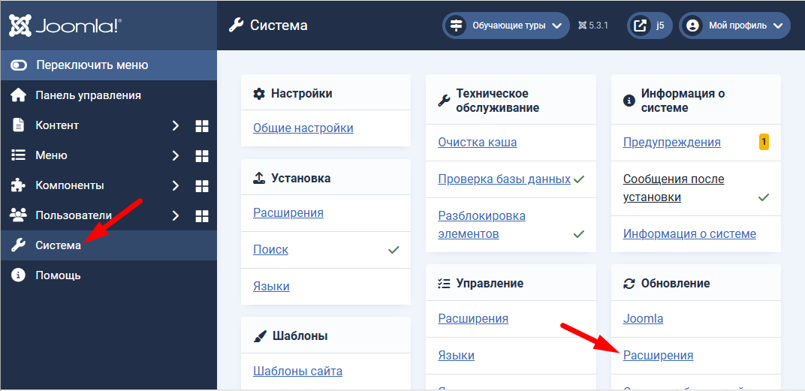
   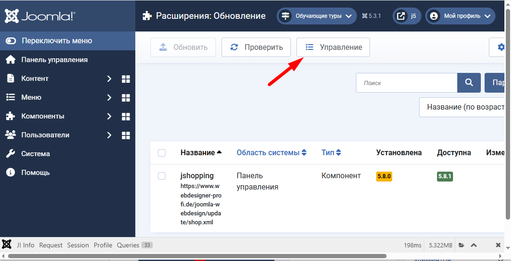
   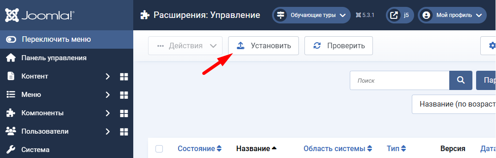
1. Нажмите на кнопку “Или выберите файл”. В открывшемся окне выберите файл с расширением и загрузите на сайт.
   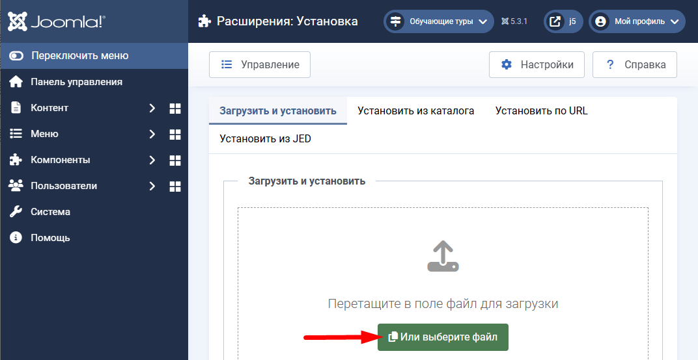

## Настройка
1. Перейдите в раздел Компоненты -> Твои платежи, нажмите кнопку Настройки
   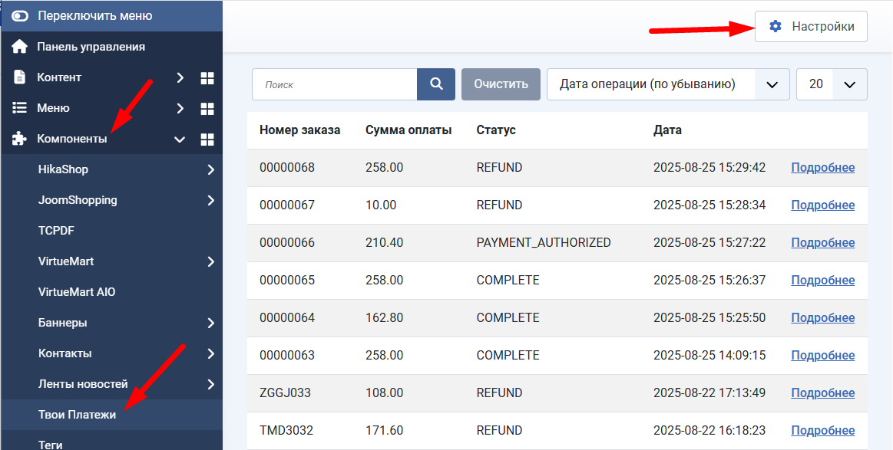
1. На вкладке Настройки укажите основные настройки, нажмите кнопку "Сохранить"
   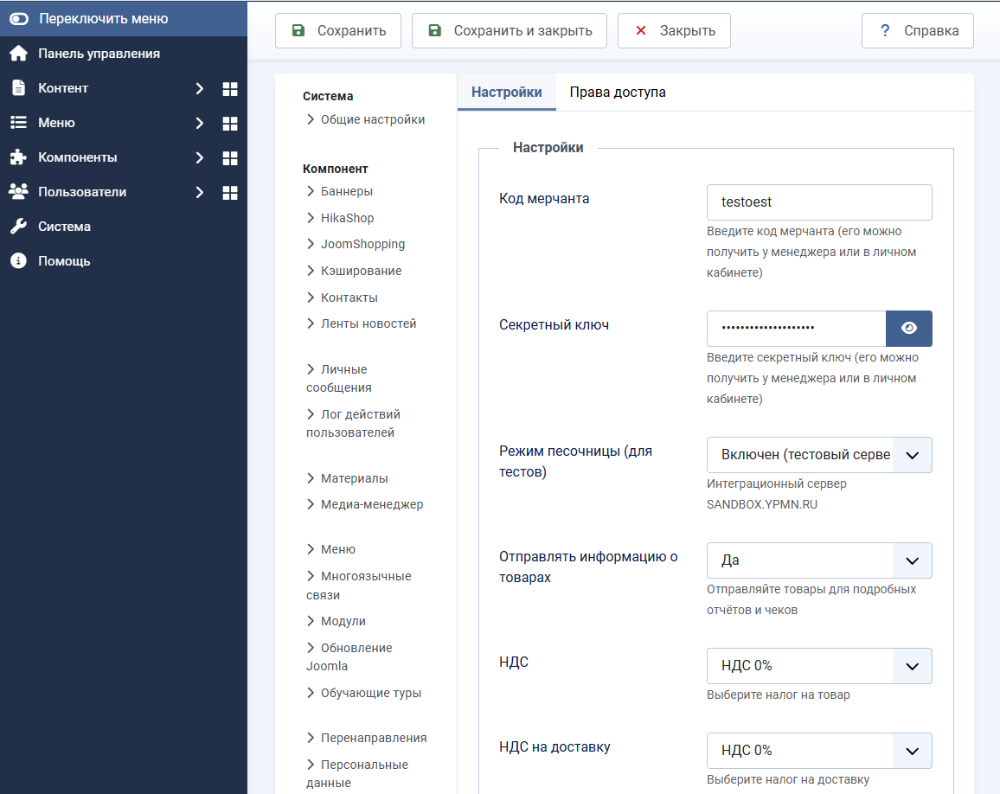

## Создайте способ оплаты
1. Для этого перейдите  раздел Компоненты -> Virtuemart -> Способы оплаты, и нажмите кнопку “Создать”
   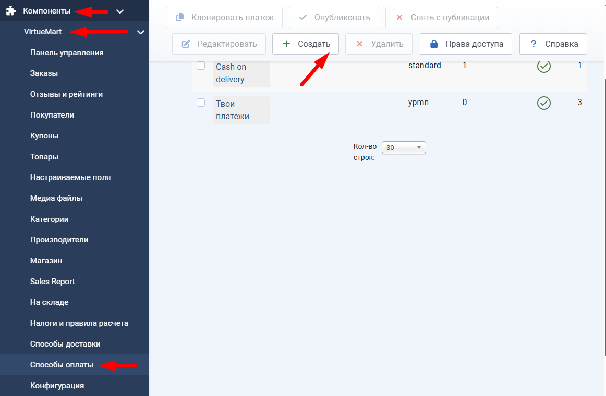

2. В открывшемся окне задайте основные параметры:
   
   **Название платежа** - например "Оплата онлайн" (будет отображаться в корзине)

   **Опубликовано** - Да
   
   **Способ оплаты** - Your Payments plugin

   **Валюта** - Russian ruble

   Нажмите кнопку “Сохранить”
   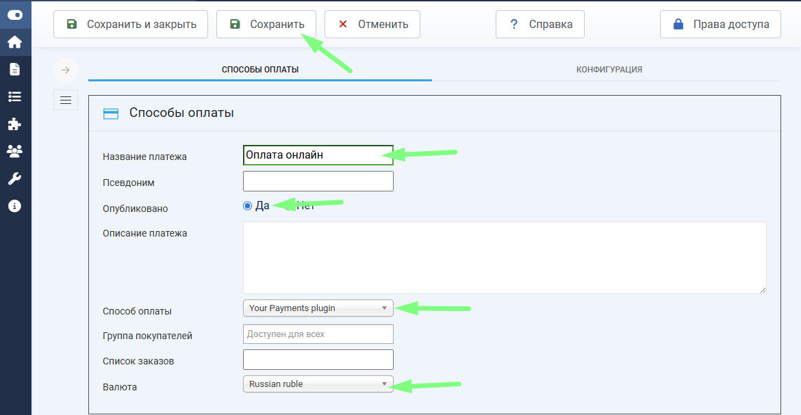

1. После сохранения перейдите на вкладку “Конфигурация”.

   Задайте способ оплаты по умолчанию и статусы заказа для соответствующих статусов платежей.
   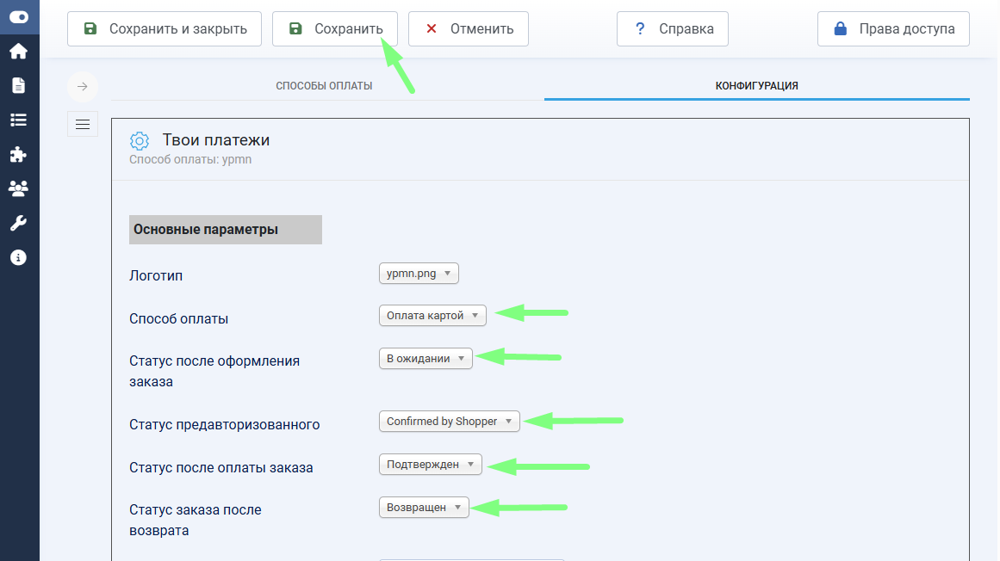
2. Так же в настройках отображается ссылка, которую нужно указать в Личном кабинете "Твои платежи" в настройках IPN уведомлений.
   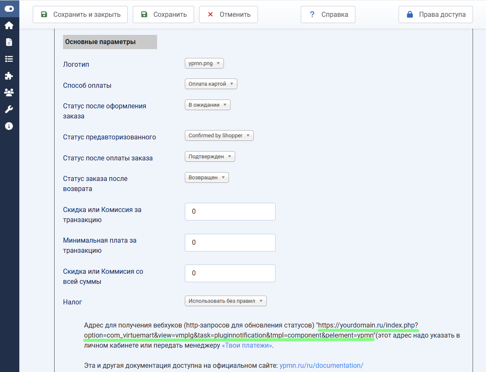
1. После, если всё настроено правильно, можно провести тестовые оплаты и посмотреть транзакции в разделе Компоненты -> Твои Платежи
   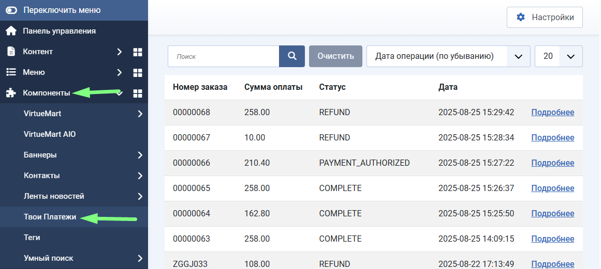

## Операции над транзакциями
### Подтверждение оплаты (для двустадийных транзакций с ручным подтверждением списания)
1. Перейдите в раздел Компоненты -> Твои платежи

   Выберите нужную транзакцию в статусе PAYMENT_AUTHORIZED, нажав ссылку "Подробнее"
   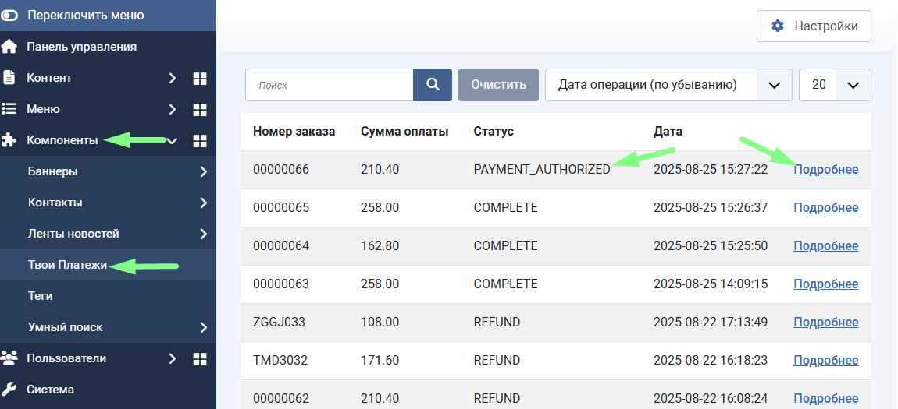
1. Перейдите на вкладку "Операции", выберите позиции в чеке, по которым будет подтверждение списания, и нажмите кнопку “Подтвердить”
   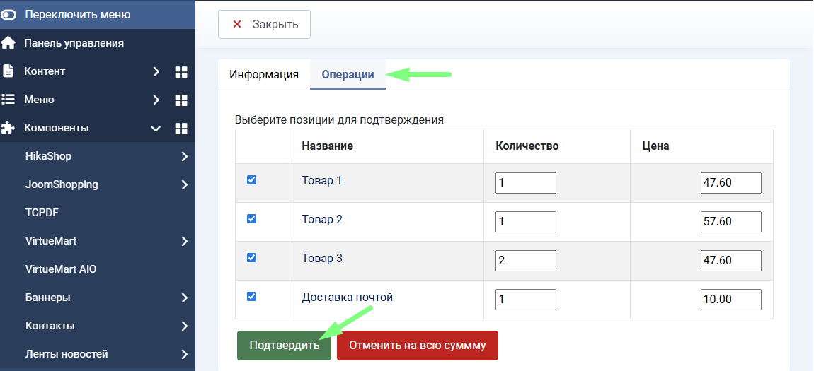
1. Дождитесь пока система получит уведомление о том, что подтверждение оплаты произошло, транзакция сменит свой статус на COMPLETE.

### Отмена оплаты (для двустадийных транзакций с ручным подтверждением списания)
Перейдите в раздел Компоненты -> Твои платежи.

Выберите нужную транзакцию в статусе PAYMENT_AUTHORIZED.

Перейдите на вкладку "Операции" и нажмите кнопку “Отменить на всю сумму”
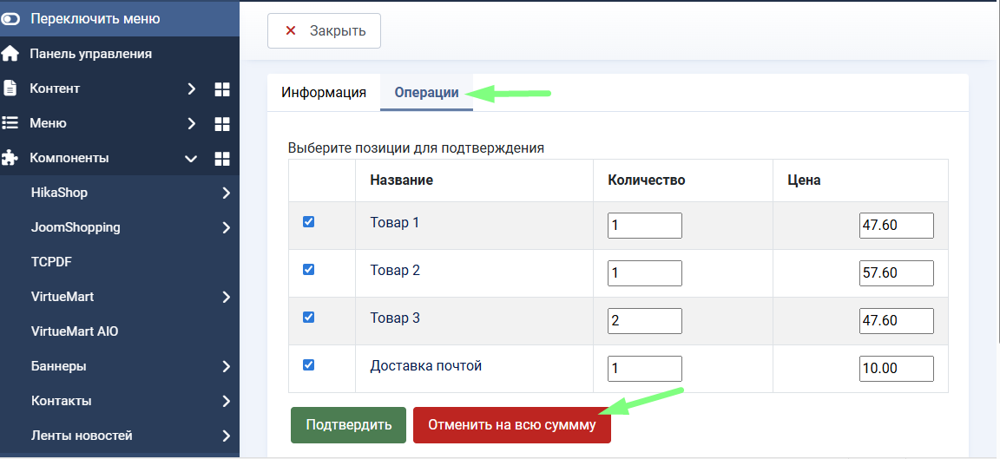
### Возврат
Перейдите в раздел Компоненты -> Твои платежи

Выберите нужную транзакцию в статусе COMPLETE

Перейдите на вкладку Операции, выберите список позиций для возврата и нажмите кнопку “Возврат”
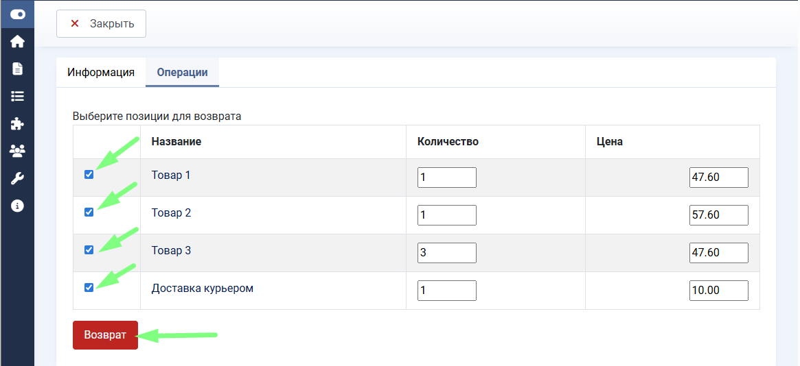

-------------

## Ссылки
- [НКО «Твои Платежи»](https://YPMN.ru/)
- [Докуметация API](https://ypmn.ru/ru/documentation/)
- [Тестовые банковские карты](https://ypmn.ru/ru/documentation/#tag/testing)
- [Задать вопрос или сообщить о проблеме](https://ypmn.ru/ru/support/)

🟢 [«Твои Платежи»](https://YPMN.ru/ "Платёжная система для сайтов, платформ и приложений") -- финтех-составляющая для сайтов, платформ и приложений